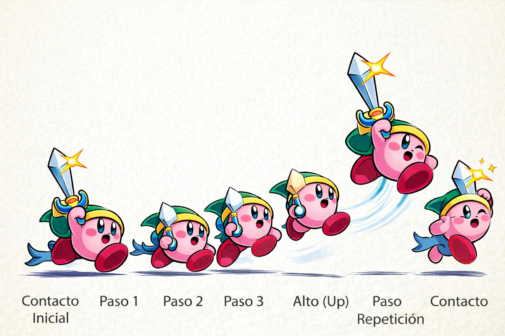

# Proyecto Integrador U2 - Walk Cycle en Blender

# Descripcion
Este proyecto consiste en la creación de una animación tipo "walk cycle" en Blender 2D.
Se realizó siguiendo una referencia, pero adaptando las poses de manera propia.

## Proceso

1. Se abrió Blender y se configuró el espacio de trabajo en 2D (Grease Pencil).
2. Se utilizó como referencia un video tutorial de YouTube para entender las poses y el flujo del walk cycle, tambien utilice la IA para tener la imagen de referencia, para poner las poses y los movimientos que se realizara
3. Se analizaron las poses principales del ciclo de caminata:
   - Contacto
   - Paso
   - Elevación
4. Se dibujaron las poses clave del personaje tomando en cuenta la forma y proporciones.
5. Se añadieron colores al personaje para darle un aspecto más visual y completo.
6. Se crearon los frames intermedios (in-betweens) para lograr una animación más fluida.
7. Se ajustó la velocidad de reproducción y se revisó la continuidad del movimiento.
8. Finalmente, se exportó la animación como video en formato (.mp4).

## Referencia de la imagen

Se utilizó la siguiente imagen como guía para las poses del walk cycle:

## Referencia en video

Se utilizó el siguiente video como guía para comprender el proceso de animación del walk cycle:

https://www.youtube.com/watch?v=0myBDB1vuq0

Se siguieron los pasos generales del tutorial, adaptándolos al personaje Kirby y agregando detalles propios como color y estilo.

## Archivos

- KIRBY.blend : archivo de Blender
- 0001-0015.mp4 : animación final

## Video

[Ver animación](./0001-0015.mp4)

## Resultado

Se logró una animación fluida de caminata basada en un ciclo continuo como un GIF.
